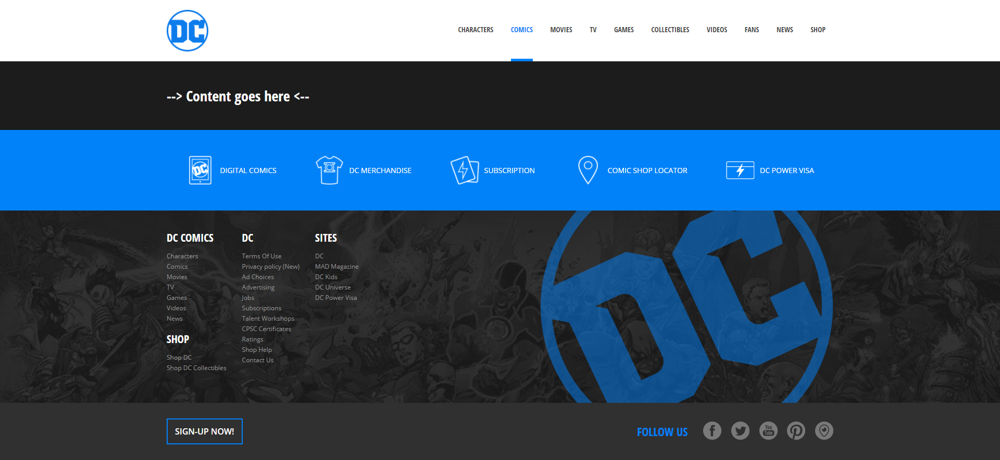

# Vite DC Comics

Crezione un nuovo progetto utilizzando Vite e Vue 3 nel quale sono definiti i componenti necessari per strutturare il layout come da screenshot allegato. Completata la struttura, si passa al primo utilizzo si sass.

